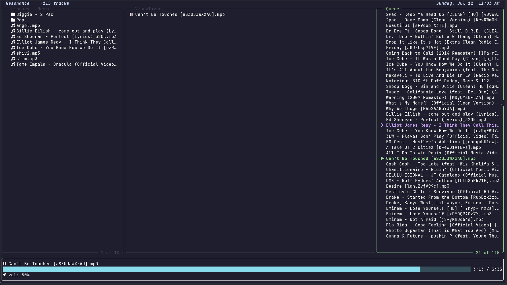

# Resonance

A terminal-based local music player written in Go.

---

## Overview

Resonance is a keyboard-driven audio player that runs entirely in the terminal. It plays MP3 files from a local directory, organized through a hierarchical library browser with a queue-based playlist model. The application uses Bubble Tea v2 for its terminal UI and the Beep audio library for playback.

The project exists to explore how low-level audio playback, real-time terminal rendering, and concurrent goroutine coordination fit together in Go.

---

## Features

- **Playback** — MP3 decode, play/pause/resume/stop, seek (`</>`), volume (`[/]`), mute, auto-advance, stale-callback filter via `playingID`
- **Library** — Hierarchical directory browser, dirs-first alphabetical sort, hidden-dir skip, history stack with back navigation, track count
- **Queue** — Ordered playlist (add/remove/clear/next/prev), recursive `ScanDir` with `mp3.Decode` validation, shuffle
- **Search** — Fuzzy match across library and queue, cursor bounds remapped to filtered set, search-interceptor before main keybindings
- **UI** — Three-panel (Library/Visual/Queue), top bar (name + count + time), footer (progress bar + time + volume), custom border renderer with active colour, `AltScreen`, 84×24 size guard, dark ANSI background with reset re-injection, `SetData`+`View` component pattern
- **Config** — `~/.config/resonance/config.json`, first-run setup wizard inline in TUI, path validation

---

## Architecture

```
                 Resonance
                      │
         ┌────────────┴────────────┐
         │                         │
    Playback Engine          Terminal UI
         │                         │
         ├──────────┬──────────────┤
         │          │              │
      Queue      Library      Components
```

The playback engine (`internal/playback`) owns the audio pipeline. The TUI layer (`internal/ui`) owns the event loop and view composition. A `playingID` counter coordinates between them: every intentional play increments the counter, and the song-ended message carries the same ID so stale callbacks from a skipped track are discarded.

Components (`internal/components`) are decoupled data-presentation units that receive state via `SetData` and return a string from `View()`. The custom renderer (`internal/renderer`) contributes border rendering with inline ANSI codes that avoid full resets.

The `types` package (`internal/types`) is kept at zero imports to break circular dependencies between packages.

The separation is designed so that the playback engine can be driven by any front-end — the TUI is one consumer.

---

## Project Structure

```
.
├── cmd/
│   └── resonance/
│       └── main.go              # Entry point, calls tui.Run()
├── internal/
│   ├── types/
│   │   ├── track.go             # Track struct (ID, Title, Path, Duration)
│   │   └── entry.go             # Entry struct (Name, Path, IsDir)
│   ├── config/
│   │   └── config.go            # JSON config load/save/validate, ~/.config/resonance/
│   ├── common/
│   │   ├── styles.go            # Shared lipgloss styles
│   │   ├── icons.go             # Nerd Font icon constants (~45 icons)
│   │   ├── progress.go          # FmtDuration, ProgressBar helpers
│   │   └── search.go            # FuzzyMatch, SearchBar
│   ├── library/
│   │   └── browser.go           # Hierarchical directory browser
│   ├── playback/
│   │   ├── player.go            # Audio playback (beep), volume, seek
│   │   ├── queue.go             # Track queue, scan directory
│   │   └── state.go             # PlaybackState enum
│   ├── components/
│   │   ├── library.go           # Library panel widget
│   │   ├── queue.go             # Queue panel widget
│   │   ├── visualiser.go        # Now-playing visualiser panel
│   │   ├── footer.go            # Playback status footer
│   │   └── toppanel.go          # Title bar with track count + time
│   ├── renderer/
│   │   └── renderer.go          # Bordered-box renderer with active colour
│   └── ui/
│       └── tui.go                # Bubble Tea model, update loop, view assembly
├── go.mod
├── go.sum
└── README.md
```

---

## Screenshots



---

## Installation

### Prerequisites

- Go 1.26.3 or later
- A terminal emulator with Unicode and Nerd Font support

### Build

```bash
git clone <repo-url>
cd resonance
go build -o resonance ./cmd/resonance/
```

---

## Usage

```bash
./resonance
```

On first launch, choose your music library path:
- Press `1` to use `~/Music`
- Press `2` to enter a custom path, then type the path and press Enter

The application will validate the directory, save the configuration, and open the player.

---

## Keyboard Shortcuts

| Key | Context | Action |
|---|---|---|
| `q` / `Ctrl+C` | Any | Quit |
| `↑` / `k` | Library / Queue | Cursor up |
| `↓` / `j` | Library / Queue | Cursor down (search-aware bounds) |
| `Enter` | Library (dir) | Open directory (clears search) |
| `Enter` | Library (track) | Clear queue, play track immediately |
| `Enter` | Queue (track) | Play selected track |
| `Backspace` / `h` | Library | Navigate to parent directory |
| `a` | Library (track) | Add track to queue |
| `a` | Library (dir) | Recursively scan and add all tracks |
| `A` | Library | Add all tracks in current directory |
| `d` | Queue | Remove track from queue |
| `Space` | Any | Pause / Resume |
| `n` | Any | Next track (wraps around) |
| `p` | Any | Previous track (wraps around) |
| `[` / `]` | Any | Volume -0.1 / +0.1 (range -3 to +3) |
| `m` | Any | Mute / Unmute toggle |
| `Tab` | Any | Switch active panel (Library ↔ Queue) |
| `←` | Any | Activate Library panel |
| `→` | Any | Activate Queue panel |
| `<` / `>` | Any | Seek -5s / +5s (wraps to end on underflow) |
| `/` | Any | Enter search mode |
| `Esc` | Search | Exit search mode, clear query |
| `Backspace` | Search | Delete last search character |
| (printable) | Search | Append to search query |

---

## Current Status

The local music player is complete and usable for playing MP3 files from a local directory. The TUI is stable, search works across both panels, seek and volume control function correctly, and the queue auto-advances through tracks.

---

## Roadmap

These features are planned but not yet implemented:

- **Metadata extraction** — parse ID3 tags for title, artist, album, duration
- **Multiple playback sources** — abstract the audio provider so the player can switch between local files and streaming sources
- **Spotify integration** — browse, search, and play from Spotify through the Web API
- **Shared listening (Jam)** — synchronise playback across multiple clients
- **Room server** — central coordination for multi-user sessions
- **WebSocket synchronization** — real-time state broadcast (play, pause, seek, queue) between clients
- **File distribution** — peer-to-peer or server-mediated track delivery
- **Background prefetching** — pre-buffer upcoming tracks to eliminate gap between songs
- **Lyrics** — timed synced lyrics display
- **Visualizer improvements** — waveform or frequency-based visual feedback

---

## Why I Built This

The project was built to explore:

- **Go** — concurrency model, interfaces, package layout
- **Terminal UI** — Bubble Tea v2 event loop, model-view architecture, terminal rendering with ANSI
- **Audio playback** — MP3 decoding, sample-rate conversion, real-time streaming
- **Concurrent programming** — goroutine coordination via channels, `sync.Once`, `speaker.Lock`
- **Modular architecture** — decoupled domains (playback, library, UI) connected through shared types
- **Real-time synchronization** — coordinating playback state with UI refresh under tight latency constraints
- **Distributed systems** — the roadmap targets multi-device synchronisation and server-client architecture

---

## Tech Stack

| Category | Libraries |
|---|---|
| TUI framework | [Bubble Tea v2](https://github.com/charmbracelet/bubbletea) (`charm.land/bubbletea/v2 v2.0.7`) |
| Styling | [Lipgloss v2](https://github.com/charmbracelet/lipgloss) (`charm.land/lipgloss/v2 v2.0.4`) |
| Audio playback | [Beep](https://github.com/gopxl/beep) (`github.com/gopxl/beep v1.4.1`) |
| MP3 decoding | [go-mp3](https://github.com/hajimehoshi/go-mp3) (`github.com/hajimehoshi/go-mp3 v0.3.4`) |
| Audio driver | [oto v3](https://github.com/ebitengine/oto) (`github.com/ebitengine/oto/v3 v3.1.0`) |
| Language | Go 1.26.3 |
| Icons | Nerd Font (v3+) |

---

## License

MIT
