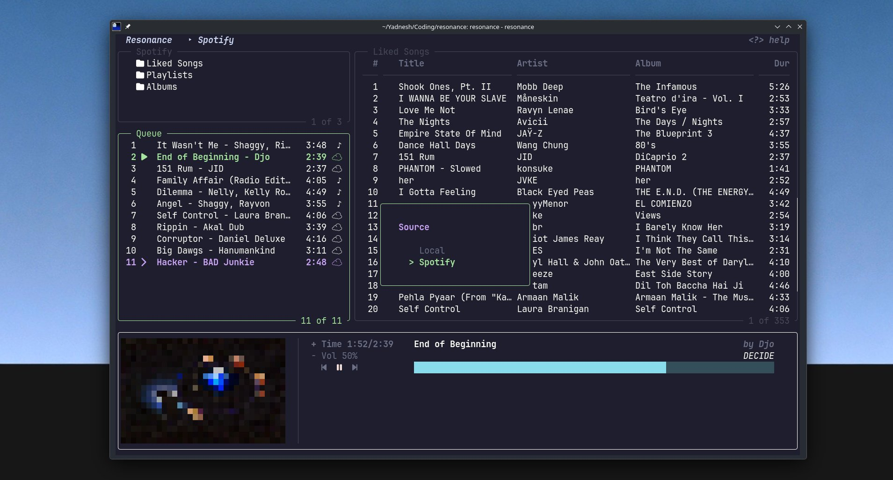

# Resonance

A terminal-native music player with unified local and Spotify playback.
---

## Overview

Resonance is a keyboard-driven terminal music player built in Go, featuring seamless local and Spotify playback through a unified queue. Designed with a modular architecture, it combines Bubble Tea, Beep, and the Spotify Web API to deliver a fast, terminal-native listening experience.
---

## Screenshots



---

## Features

- **Playback** — MP3 decode, play/pause/resume, seek (`</>`), volume (`[/]`), mute, auto-advance, stale-callback filter via `playingID`
- **Metadata** — ID3 tag extraction for title, artist, album, duration, and embedded cover art (`dhowden/tag`)
- **Cover art** — embedded or Spotify album art rendered in the footer as ANSI half-block art
- **Library** — Hierarchical directory browser, dirs-first alphabetical sort, hidden-dir skip, history stack with back navigation, track count
- **Queue** — Mixed local + Spotify queue (add/remove/clear/next/prev/shuffle), recursive `ScanDir` with `mp3.Decode` validation
- **Search** — Fuzzy match across library and queue, cursor bounds remapped to filtered set, search-interceptor before main keybindings
- **Spotify** — OAuth login via CLI, browse **Liked Songs / Playlists / Albums**, drill into playlists and albums, playback on an active Spotify Connect device, auto-refreshing access tokens, album art in the footer
- **Source switching** — `Ctrl+S` overlay to switch between Local and Spotify sources
- **UI** — Top bar (source + track count + help hint), Library/Queue left column, Tracks/Content panel right, footer (cover art + progress + volume + controls), `?` help overlay, `AltScreen`, 84×28 size guard, dark ANSI background with reset re-injection, `SetData`+`View` component pattern
- **Config** — `~/.config/resonance/config.json`, first-run setup wizard inline in TUI, path validation

> **Note (Feb 2026):** Spotify now returns `403` for the tracks of any playlist you don't own or collaborate on — even public ones. Browsing playlists is therefore limited to your own playlists.

---

## Architecture

```
                 Resonance
                      │
         ┌────────────┴────────────┐
         │                         │
  Playback Controller         Terminal UI
         │        │               │
     Local       Spotify        Components
     (beep)     (Connect)
```

The playback engine (`internal/playback`) owns the audio pipeline. A `Controller` dispatches every queue track to the right backend: local tracks play through the Beep `Player`, Spotify tracks are sent to an active Spotify Connect device via the Web API client. A `types.Track.Source` enum (`Local` / `Spotify`) decides the backend, so a single queue can interleave both sources and the UI only ever talks to the controller.

The TUI layer (`internal/ui`) owns the event loop and view composition. A `playingID` counter coordinates between them: every intentional play increments the counter, and the song-ended message carries the same ID so stale callbacks from a skipped track are discarded. Spotify playback has no local stream, so its position/ended state is polled from the device at most every ~5 seconds while playing.

Components (`internal/components`) are decoupled data-presentation units that receive state via `SetData` and return a string from `View()`. The custom renderer (`internal/renderer`) contributes border rendering with inline ANSI codes that avoid full resets.

The `types` package (`internal/types`) is kept at zero imports to break circular dependencies between packages.

---

## Project Structure

```
.
├── assets/
│   └── resonance.png             # UI screenshot
├── cmd/
│   └── resonance/
│       └── main.go               # Entry point + `spotify` CLI subcommands
├── docs/
│   └── learning_notes.md         # Dev notes and planned shared-listening specs
├── internal/
│   ├── types/
│   │   ├── track.go              # Track struct (ID, Title, Artist, Album, CoverArt, Source, ...)
│   │   └── entry.go              # Entry struct (Name, Path, IsDir)
│   ├── config/
│   │   └── config.go             # JSON config load/save/validate, ~/.config/resonance/
│   ├── common/
│   │   ├── styles.go             # Shared lipgloss styles
│   │   ├── icons.go              # Nerd Font icon constants
│   │   ├── progress.go           # FmtDuration, ProgressBar helpers
│   │   ├── search.go             # FuzzyMatch, SearchBar
│   │   ├── metadata.go           # ID3 tag extraction (dhowden/tag)
│   │   └── cover.go              # ANSI half-block cover-art rendering
│   ├── library/
│   │   └── browser.go            # Hierarchical directory browser
│   ├── playback/
│   │   ├── player.go             # Local audio playback (beep), volume, seek
│   │   ├── queue.go              # Track queue, directory scan
│   │   ├── state.go              # PlaybackState enum
│   │   └── controller.go         # Dispatches tracks to local player or Spotify Connect
│   ├── spotify/
│   │   ├── auth.go               # OAuth authorization-code flow
│   │   ├── credentials.go        # Client ID/secret + token storage
│   │   ├── client.go             # Spotify Web API client
│   │   └── types.go              # Spotify API response types
│   ├── components/
│   │   ├── library.go            # Library panel
│   │   ├── queue.go              # Queue panel
│   │   ├── tracks.go             # Tracks / content panel
│   │   ├── footer.go             # Footer with cover art, progress, controls
│   │   ├── toppanel.go           # Title bar (source, track count, help hint)
│   │   └── sourceswitch.go       # Local / Spotify source-switch overlay
│   ├── renderer/
│   │   └── renderer.go           # Bordered-box renderer with active colour
│   └── ui/
│       ├── tui.go                # Bubble Tea model, update loop, view assembly
│       └── spotify.go            # Spotify browsing / drill key handlers
├── go.mod
├── go.sum
└── README.md
```

---

## Installation

### Prerequisites

- Go 1.26.3 or later
- A terminal emulator with Unicode and Nerd Font support
- For Spotify playback: a Spotify account (Premium) and an active Spotify Connect device (phone, desktop app, etc.)

### Build

```bash
git clone <repo-url>
cd resonance
go build -o resonance ./cmd/resonance/
```

### Spotify setup

1. Create an app at the [Spotify Developer Dashboard](https://developer.spotify.com/dashboard) and add `http://127.0.0.1:8888/callback` to its Redirect URIs.
2. Authenticate:

```bash
./resonance spotify login
```

You'll be prompted for your app's Client ID and Client Secret, then taken to Spotify to authorize. Credentials are stored at `~/.config/resonance/credentials/spotify.json` (owner-only permissions) and access tokens auto-refresh. The following scopes are requested: `user-read-private user-read-email user-library-read playlist-read-private playlist-read-collaborative user-modify-playback-state user-read-playback-state`.

---

## Usage

```bash
./resonance
```

On first launch, choose your music library path:
- Press `1` to use `~/Music`
- Press `2` to enter a custom path, then type the path and press Enter

The application will validate the directory, save the configuration, and open the player. Press `Ctrl+S` to switch between Local and Spotify sources.

### Spotify CLI

| Command | Description |
|---|---|
| `resonance spotify login` | Authenticate with Spotify (Client ID + Secret) |
| `resonance spotify logout` | Remove stored Spotify credentials |
| `resonance spotify whoami` | Display your Spotify profile |

---

## Keyboard Shortcuts

### Global

| Key | Action |
|---|---|
| `q` / `Ctrl+C` | Quit |
| `?` | Toggle help overlay |
| `Ctrl+S` | Open source switch (Local ↔ Spotify) |
| `Tab` | Cycle active panel (Library → Tracks → Queue) |
| `Space` | Pause / Resume |
| `n` / `p` | Next / Previous track (wraps around) |
| `[` / `]` | Volume -0.1 / +0.1 (range -3 to +3) |
| `m` | Mute / Unmute toggle |
| `<` / `>` | Seek -5s / +5s (wraps to end on underflow) |

### Navigation

| Key | Context | Action |
|---|---|---|
| `↑` / `k` | Library / Tracks / Queue | Cursor up |
| `↓` / `j` | Library / Tracks / Queue | Cursor down (search-aware bounds) |
| `Enter` | Library (dir) | Open directory (clears search) |
| `Enter` | Library / Tracks (track) | Clear queue, play track immediately |
| `Enter` | Queue (track) | Play selected track |
| `Backspace` / `h` | Library | Navigate to parent directory |

### Queue

| Key | Context | Action |
|---|---|---|
| `a` | Track | Add track to queue |
| `a` | Directory | Recursively scan and add all tracks |
| `A` | Library / Tracks | Add all tracks in current directory |
| `d` | Queue | Remove track from queue |

### Search

| Key | Action |
|---|---|
| `/` | Enter search mode |
| (printable) | Append to search query |
| `Backspace` | Delete last search character |
| `Esc` | Exit search mode, clear query |

### Spotify browsing

| Key | Context | Action |
|---|---|---|
| `↑` / `↓` | Categories | Navigate Liked Songs / Playlists / Albums (moving the cursor loads content) |
| `↑` / `↓` | Content | Navigate tracks / playlists / albums |
| `Enter` | Playlist / album list | Drill into the highlighted item |
| `Enter` | Track list | Add highlighted track to queue |
| `Backspace` | Drilled playlist/album | Return to the category list |
| `a` | Track | Add highlighted track to queue |
| `↑` / `↓` + `Enter` | Source switch | Select Local / Spotify source |

---

## Current Status

Local and Spotify playback are both usable. The local library browses MP3s with ID3 metadata and cover art, the queue interleaves local and Spotify tracks, and Spotify browsing covers Liked Songs, your own Playlists, and Albums with playback routed to an active Spotify Connect device. Search, seek, volume, source switching, and auto-advance all work across panels.

---

## Roadmap

These features are planned but not yet implemented:

- **Spotify search** — search the whole catalog and play results
- **Shared listening (Jam)** — synchronise playback across multiple clients
- **Room server** — central coordination for multi-user sessions
- **WebSocket synchronization** — real-time state broadcast (play, pause, seek, queue) between clients
- **File distribution** — peer-to-peer or server-mediated track delivery
- **Background prefetching** — pre-buffer upcoming tracks to eliminate gap between songs
- **Lyrics** — timed synced lyrics display
- **Visualizer improvements** — waveform or frequency-based visual feedback

---

## Why I Built This

The project was built to explore:

- **Go**
- **Terminal UI** — Bubble Tea v2 event loop, model-view architecture, terminal rendering with ANSI

along with

- **Audio playback** — MP3 decoding, sample-rate conversion, real-time streaming
- **Metadata & cover art** — ID3 tag parsing, image decoding, half-block ANSI rendering
- **Concurrent programming** — goroutine coordination via channels, `sync.Once`, `speaker.Lock`
- **Modular architecture** — decoupled domains (playback, library, UI) connected through shared types
- **External APIs** — OAuth authorization-code flow, the Spotify Web API, and Spotify Connect device control
- **Real-time synchronization** — coordinating playback state with UI refresh under tight latency constraints
- **Distributed systems** — the roadmap targets multi-device synchronisation and server-client architecture

---

## Tech Stack

| Category | Libraries |
|---|---|
| TUI framework | [Bubble Tea v2](https://github.com/charmbracelet/bubbletea) (`charm.land/bubbletea/v2 v2.0.7`) |
| Styling | [Lipgloss v2](https://github.com/charmbracelet/lipgloss) (`charm.land/lipgloss/v2 v2.0.4`) |
| Audio playback | [Beep](https://github.com/gopxl/beep) (`github.com/gopxl/beep v1.4.1`) |
| MP3 decoding | [go-mp3](https://github.com/hajimehoshi/go-mp3) (`github.com/hajimehoshi/go-mp3 v0.3.4`) |
| Audio driver | [oto v3](https://github.com/ebitengine/oto) (`github.com/ebitengine/oto/v3 v3.1.0`) |
| Metadata | [dhowden/tag](https://github.com/dhowden/tag) (`github.com/dhowden/tag v0.0.0-20240417053706-3d75831295e8`) |
| Spotify | Web API + OAuth (authorization code flow) |
| Language | Go 1.26.3 |
| Icons | Nerd Font (v3+) |

---

## License

MIT
